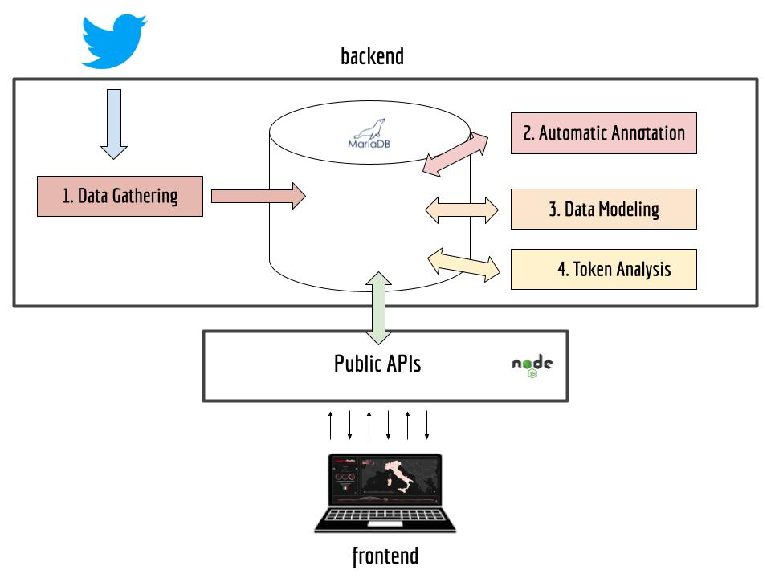

# mappa.controlodio.it

Mappa.controlodio.it is a web application composed of three modules: , ,  and .
The backend gets tweets from the Twitter’s Stream APIs and stores them in a database.
The frontend  represents the data stored in the database in the simplest, most complete and effective way possible.
The public APIs finally allow the frontend to recover the data for the visualizations. 

