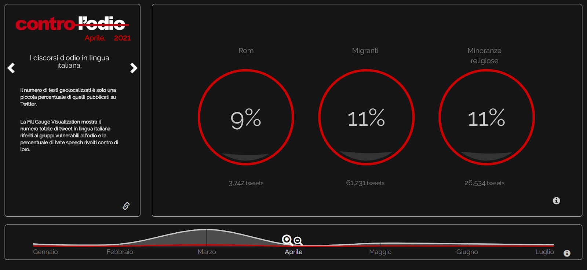

## Introduction

The front-end was developed with the intention of representing the data stored in the database in the simplest, most complete and effective way possible. The data, accessible via public APIs, have different domains and have been divided into categories. Each visualization shows a different category of data.

All visualizations are controlled by the user through an interactive timeline showing the total number of tweets.

The main visualization, a choropleth map, shows the dimensions of the temporal and geographic data. Liquid fill gauge shows all aggregated data by target of interest and time. There are also visualizations that show the most popular tweets by target of interest, the most used words in the tweets, and the co-occurrence between words.

The front end was developed entirely in HTML, CSS and javascript, mainly thanks to the following libraries and frameworks: *Angular.js, D3.js, jQuery, masonry.js* and *Bootstrap*.

   

## Subdivision of files and folders

The frontend is divided into components according to the Angular.js framework paradigm. Each visualization corresponds to a component (inside the components folder) and a CSS style sheet.

The *index.css* file contains the style of the page and of the visualization containers.

Below, for each visualization, are presented the JS and CSS files, and the APIs used:

- Liquid fill gauge:
  - Shows aggregated data of number of tweets and percentage of HS for each target.
  - JS: *components/liquid.js*
  - CSS: *css/index.css*
  - APIs used: *daily_frequency_topic*
- Main map:
  - Choropleth map showing information on the percentage of HS in reference to regions or provinces.
  - JS: *components/map.js*
  - CSS: *css/map.css*
  - APIs used: *daily_frequency*, *daily_frequency_topic*
- Slider:
  - It allows the user to select a time period and shows in the form of a line chart the number of total tweets and the number of tweets marked as containing HS.
  - JS: *components/slider.js*
  - CSS: *css/temporal_slider.css*
  - APIs used: *daily_frequency*, *daily_frequency_topic*
- Tweets virality:
  - Shows the most popular tweets about the target selected by the user. The implementation of the visualization is developed thanks to the library *masonry.js.*
  - JS: *components/virality_tweets.js*
  - CSS:
  - APIs used: *daily_virality*
- Top words:
  - Show the most used words in tweets. They can be sorted by percentage of HS or by occurrence.
  - JS: *components/words.js*
  - CSS: *css/bar_chart.css*
  - APIs used: *tokenfrequency*
- Word co-occurrence network:
  - Shows the network of co-occurrences between words and the HS percentage of tweets that contain those words.
  - JS: *components/words.js*
  - CSS: *css/word_co.css*
  - APIs used: *tokencorrelation*

   

## Visualizations

### **Choropleth Map and Line Chart Slider**

The choropleth map shows the intensity of average hate speech in Italy in the selected time period. Each region (or province) will be assigned a color (the color palette was chosen with the help of colorbrewer2.org) based on the number of tweets containing hate speech divided by the total number of tweets. The tweets taken into account in the display, based on user selection, may refer to only one of the target groups (Roma, religion, ethnic groups) or to all three aggregate targets.

The choropleth map is interactive, the user can use the zoom function, download the map and can click on a region to obtain detailed information on the data represented.

The user can select various color scales, linear between 0 and 1, based on the average of the last 30 days, or based on the median.

In addition, at any time the user can transform the map into a Dorling map, which allows to simultaneously view the HS value (represented by the color) and the total number of tweets produced (represented by the radius).

The line chart slider below shows the trend of the total number of tweets relative to the three aggregate interest targets. As for the choropleth map, it is possible to view only the data belonging to only one of the targets.

The line chart slider, common to all views, is interactive and allows a temporal exploration of the data: the user can select a year, a month or a day and the data represented will then be aggregated over time based on the selection.

 

### **Liquid fill gauge**

The choropleth map shows only a subset of the data stored in the database, i.e. tweets that have a spatial dimension. Liquid fill gauge represents the value of all the tweets that refer to the targets of interest, taking into consideration both the georeferenced tweets and the tweets of which we have no spatial information.

For each target of interest, the total number of tweets and the relative hate speech value will be represented. The values of this visualization are updated based on the user's time selection on the line chart slider.

 

### **Tweets virality**

This visualization shows the most popular tweets in relation to the target of interest. The user can decide whether to view the most popular tweets relating to all three aggregate targets or to just one of the targets.

The user can filter tweets by time, using the line chart slider, or by *type* of virality: tweets with the most number of retweets, quotes or replies.

 

### **Top words**

This visualization shows the 25 most frequent words in tweets. The bar plot has two y axes: the first axis shows the occurrence of words, the second axis shows the average percentage of HS in the tweets that contain that word. Words can be sorted by occurrence or by percentage of HS.

By clicking on a word, the user can view more information on the sidebar and can open the network of co-occurrences of the selected word. In addition, it is possible to view the 25 most frequent words in the form of a word cloud.

 

### **Word co-occurrence network**

This visualization shows the network of 10 words that occur most frequently with the selected word. Inside the node of each word is shown the number of tweets in which both words are present. Around the node with a red arc is represented the average of the HS percentage of the tweets that contain both words.

